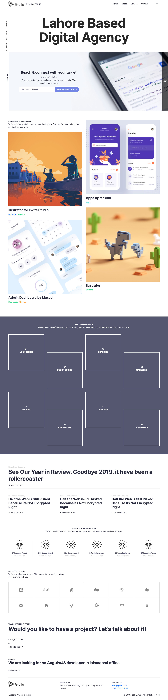

# Lahore Based Digital Agency

Ini merupakan latihan dengan menggunakan scss, pug dan gulp. untuk demo bisa melihat tautan berikut.

[Lahore Baased Digital Agency](https://yudiantara-gde.github.io/lahore/dist/).

**Catatan :**
Desain dari latihan ini berupa file sketch yang mana untuk saat ini hanya tersedia untuk MAC OS. Desain bisa dilihat di folder `design` atau kamu bisa gunakan [tautan berikut] (https://www.sketchappsources.com/free-source/4197-agency-web-template-sketch-freebie-resource.html) untuk mendownload secara langsung.

Yang perlu diperhatikan, ini bukan desain dari saya. saya hanya menggunakan untuk latihan untuk mempelajari tentang node, sass, pug dan bootstrap.

## Halaman

-   [Awal](#overview)
    -   [Cara Installasi](#running-code)
    -   [Screenshots](#screenshots)
    -   [Links](#links)
-   [My process](#my-process)
    -   [Built with](#built-with)
    -   [Style](#styles)
    -   [What I learned](#what-i-learned)
    -   [Useful resources](#useful-resources)
-   [Author](#author)

## Overview

Selamat mencoba!

### Running Code

untuk menjalan dan melihat hasil Halaman HTML, silahkan ikuti langkah-langkah berikut :

-   silahkan install semua pakage yang diperlukan dengan menggunakan `npm install` di terminal. jangan lupa masuk terlebih dahulu kedalam folder dari latihan ini. tempat di folder httdocs dari xampp atau mamp.

-   setelah semua proses selesai, ketikan `gulp` di terminal.

-   buka browser mu, ketik `http://localhost:8080/`dan hanya itu. enjoy!

-   jika saya ingin tempatkan hasil html di folder tertentu, harus bagaimana ? well ... itu bisa di set di `gulpfile.js`, pada bagian kode seperti di bawah ini.

```js
// set the directory and port
function reload(done) {
    connect.server({
        root: 'dist/',
        livereload: true,
        port: 8080
    });

    done();
}

<!-- 
### Screenshots




### Links

-   Design URL: [Graphberry](https://www.sketchappsources.com/free-source/4197-agency-web-template-sketch-freebie-resource.html)
-   Source Code URL: [Github](https://github.com/yudiantara-gde/lahore)
-   Live Site URL: [Github Pages](https://yudiantara-gde.github.io/lahore/)

## My process

### Built with

-   [Bootstrap 5.0] (https://getbootstrap.com/docs/5.0/getting-started/introduction/)
-   [SCSS] (https://sass-lang.com/documentation/)
-   [Pug.js] (https://pugjs.org/api/getting-started.html)
-   [Gulp.js @4.0.2] (https://gulpjs.com/)
-   [Font Awesome Library @6.2.0] (https://fontawesome.com/)
-   [Normalize.css Library @8.0.1] (https://necolas.github.io/normalize.css/)
-   [Animate.css Library] (https://github.com/animate-css/animate.css)
-   [WOW.js Library] (https://github.com/matthieua/WOW)

### Styles

#### Colors

-   Primary: #7486e5
-   Gray: #f5f7fc
-   White: #ffffff
-   Black : #28293d

#### Fonts

-   Family: [Inter](https://fonts.google.com/specimen/Inter?query=inter)
-   Weights: 400, 500, 700

### Apa saja yang baru saya pelajari ?

```scss
&:last-child {
    @media (min-width: 992px) {
        grid-column-end: -1;
    }
}
```

```js
// Counters Start When Visible On Screen
const counters = document.querySelectorAll(".about .boxes-holder .box span");
const speed = 300;
window.addEventListener("scroll", () => {
    if (window.scrollY >= document.querySelector(".about").offsetTop - 250) {
        counters.forEach((counter) => {
            const updateCount = () => {
                const target = parseInt(+counter.dataset.count);
                const count = parseInt(+counter.innerText);
                const increment = Math.trunc(target / speed);
                if (count < target) {
                    counter.innerText = count + increment;
                    setTimeout(updateCount, 10);
                } else {
                    count.innerText = target;
                }
            };
            updateCount();
        });
    }
});

// Formating Currency And Removing Decimals
function formatCurrency(value) {
    return value
        .toLocaleString("en-US", {
            style: "currency",
            currency: "USD",
        })
        .slice(0, -3);
}

// Agents Names
agentName.innerHTML = `${agent.gender === "male" ? "Mr" : "Mrs"}. ${agent.name}`;
```

Apartment JSON Model:

```json
[
    {
        "img": "images/apartment-4.webp",
        "address": "308 Negra Arroyo Lane, Albuquerque",
        "price": "4861",
        "bed": "3",
        "kitchen": "2",
        "shower": "1"
    }
]
```

Agent JSON Model:

```json
[
    {
        "photo": "images/agent-4.webp",
        "job": "Frontend Developer",
        "name": "Sarah Jones",
        "gender": "female",
        "twitUser": "PhilopaterHany4",
        "githubUser": "PhilopaterHany",
        "linkedinUser": "philopater-hany"
    }
]
```

### Useful Resources

-   [Bootstrap 5.0] (https://getbootstrap.com/docs/5.0/getting-started/introduction/)
-   [MDN: Fetch API](https://developer.mozilla.org/en-US/docs/Web/API/Fetch_API)
-   [Pug.js Documentation](https://pugjs.org/api/getting-started.html)
-   [Sass Documentation](https://sass-lang.com/documentation/)
-   [Gulp.js Documentation](https://gulpjs.com/docs/en/getting-started/quick-start/)
-   [npm Documenation](https://docs.npmjs.com/)
-   [Font Awesome Documentation](https://fontawesome.com/docs)
-   [Animate.css Documentation](https://animate.style/)
-   [WOW.js Documentation](https://wowjs.uk/docs.html)

## Author

yudiantara.gde
